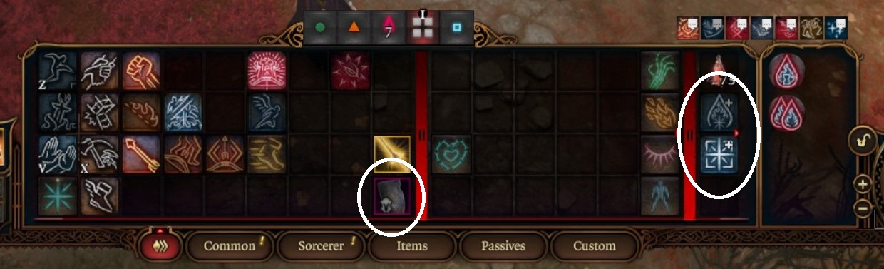

# A Baldur's Gate 3 Exploit Macro

Note to clear up any confusion: this directory is a collection of scripts I wrote for use when playing [Baldur's Gate 3](https://store.steampowered.com/app/1086940/Baldurs_Gate_3/). This should NOT be confused with the other Games directory, which is a collection of games to play.

In Baldur's Gate 3, certain classes are granted access to spell slots. These are used as a sort of currency and allow the character to cast certain learned spells. For example, Level 1 Sorcerers are granted two first-level spell slots, meaning they can cast two first-level spells. All spell slots are only refreshed after a long rest (ending the day), so as long as you consistently have enough materials to do so, you can just repeatedly do that after running out of spell slots, right?

Well, a potential problem with this is in the highest difficulty (as of Patch 7) Honor Mode, consecutive long rests get progressively more expensive, not to mention any buffs your party has will go away and any time sensitive quests may be affected after ending the day enough times.

One of the things that makes Sorcerers unique is that they have access to what's called Sorcery Points (also refreshed after a long rest), and they can be used to activate certain class [Metamagic](https://bg3.wiki/wiki/Metamagic) or create spell slots.

This macro utilizes the infinite sorcery points and spell slots [exploit](https://youtu.be/McnZwKkqanQ?si=U0h2VT1BLgwUji96) (Note: the video title is clickbait; it is SFW) to get an infinite amount of spell slots. Certain gear comes with bonuses in the form of stat boosts (applied when equipped) or skills (usually refreshed after a long rest). A select few (specifically two, I believe) give the player an additional spell slot. The basic premise of the exploit is to equip this piece of gear, use the spell slot, unequip, and repeat. For some reason, the spell slot benefit is still able to be used. Normally this is not the case; if you use a skill from a piece of gear, unequipping and re-equipping will not allow you to use the skill again until you end the day via a long rest.

Below are before and after images for a Level 12 Sorcerer.

It seems that the game stores the maximum number of spell slots as a number, which is inflated by the exploit. I think the reason long-resting does not work in the same manner as Angelic Reprieve potions (which restores health and first and second level spell slots) is that long-resting also resets any party buffs and will hard reset this value to what it is supposed to be (as defined in your class tree(s)).

The macro utilizes this exploit (the second and third methods outlined in the video) to give you the amount of spell slots and sorcery points you specify. I opted to use these two because Angelic Reprieve potions can be expensive in the higher difficulties and repeatedly purchasing them can add up, assuming no other party members or players want to use them. Additionally, Method 2 only requires a one-time purchase and is available earlier than the third and fourth methods, while also adhering to the choices I would most likely make in a playthrough. Having the amulet from Act 3 is the most efficient since it will give you more sorcery points per cast and only requires robbing a bank vault (free), however this requires using a game version before Patch 7 because that was when the amulet was patched.

Note that icon positions and subsequent mouse positions in the macro are the measurements I made, so they may not be the same for you. I recommend testing the mouse positions first with `mouse_pos.py` and adjusting the UI to your liking before running the macro. Also be sure to adjust the spell slot and sorcerer point amounts to your liking before using. This macro requires being a Sorcerer of at least level 2, and works as of Patch 7 when using the shield. If you want to use the amulet, any pre-Patch 7 version should work. This works with a minimum of 30 FPS (but higher will be more consistent; I like ~45) and should work at any point in the game (does not have to be after long resting). If the delta between your current and target spell slots is very low, the macro will most likely give you extra first or second level spell slots (depending on if you are using the shield or amulet), since the macro assumes you will have none of the spell slot level the gear gives you.

Before running the macro, unequip any two-handed weapon if you are using one. If you use the macro's measurements, set up your UI according to the image below. If not, you will need to organize your UI to your liking, re-measure the mouse coordinates, and update their positions in the code. Once that is done, you can run `python bg3_inf_sorcspell.py` in a terminal window. Then, make sure the Baldur's Gate 3 window is in focus and press Shift+R. You should see a message in the terminal and the macro will begin shortly. Please note that the macro is so powerful, there is no graceful way of stopping it, so ensure that the Baldur's Gate 3 window remains in focus until the macro is finished. <b>This is not a fast macro if you want a lot of spell slots,</b> so do not expect it to be done in a minute or two (as an example, the post-run image above took 32 minutes). As of now, this only works on Windows.

